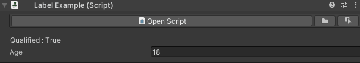

# EzyInspector [](https://github.com/gamedev-uv/EzyInspector/blob/main/LICENSE)

**Makes working and customizing the inspector easier!**

# Table of Contents
> [!NOTE]  
> Better override support will soon be added as well!
  - [Installation](#installation)
  - [Dependencies](#dependencies)
  - [Attributes](#attributes)
    <details>
      <summary><a href="#formatting">Formatting</a></summary>

      - [HideMonoGUI](#hidemonogui)

      - [DefaultMonoGUI](#defaultmonogui)

      - [Button](#button)

      - [ToggleButton](#togglebutton)

      - [DisplayAsLabel](#displayaslabel)

      - [TagSelector](#tagselector)

      - [ReadOnly](#readonly)

    </details>
    <details>
      <summary><a href="#serialization">Serialization</a></summary>

      - [GUID](#guid)

      - [ForceInterface](#forceinterface)

    </details>
    <details>
      <summary><a href="#conditional">Conditional</a></summary>

      - [EditModeOnly](#editmodeonly)

      - [ShowIf](#showif)

    </details>
    <details>
      <summary><a href="#callbacks">Callbacks</a></summary>

      - [OnInspectorUpdated](#oninspectorupdated)
      - [OnSceneGUI](#onscenegui)

    </details>

> [!IMPORTANT]
> ### Installation
> This package requires the [**EzyReflection**](https://github.com/gamedev-uv/EzyReflection) package in order to function. Make sure you install that package before installing this one.
> Through the [**Unity Package Manager**](https://docs.unity3d.com/Manual/upm-ui-giturl.html) using the following Git URLs:
>>```
>>https://github.com/gamedev-uv/EzyReflection.git
>>```
>>```
>>https://github.com/gamedev-uv/EzyInspector.git
>>```

# Dependencies 
 - [**EzyReflection**](https://github.com/gamedev-uv/EzyReflection)

# Attributes


## Formatting
 Attributes that affect how data is displayed or formatted in the inspector

> [!NOTE]  
> This package updates the mono gui to look something like this : 

>
> Open Script : Opens the script in the specified External Script Editor\
> Ping Script : Pings the script in the Project folder\
> Select Script : Selects the given script


### HideMonoGUI

Hides the open script UI from the inspector.

```cs
using UnityEngine;
using UV.EzyInspector;

[HideMonoScript]
public class ExampleHideMonoScript : MonoBehaviour {...}
```


### DefaultMonoGUI
Draws the default MonoScript GUI in the inspector.

```cs
using UnityEngine;
using UV.EzyInspector;

[DefaultMonoGUI]
public class ExampleDefaultMonoGUI : MonoBehaviour {...}
```


### Button

Used to draw buttons in the Unity inspector. This attribute allows methods to be displayed as buttons in the Unity editor interface.

**`ButtonAttribute(string buttonName)`**
   Creates a button with a specified display name. By default, the button is drawn after the default editor elements.
   - **Parameters:**
     - `buttonName` (string): The display name of the button.

```cs
using UnityEngine;
using UV.EzyInspector;

public class ExampleButtonScript : MonoBehaviour
{
    [Button("Custom Button")]
    private void CustomButton()
    {
        Debug.Log("Custom button clicked!");
    }
}
```


### ToggleButton

Creates a toggle button in the inspector for the given bool.

**`ToggleButtonAttribute(string onLabel, string offLabel)`**  
Displays a toggle button in the inspector with the specified labels for the on and off states.

- **Parameters:**
  - `onLabel` (string): The label to display when the button is toggled on.
  - `offLabel` (string): The label to display when the button is toggled off.

```csharp
using UnityEngine;
using UV.EzyInspector;

public class ToggleButtonExample : MonoBehaviour
{
    [SerializeField, ToggleButton("[ON] Click to turn off", "[OFF] Click to turn on")]
    private bool _toggleExample;
}
```

> [!NOTE]
> Only valid on booleans

### DisplayAsLabel

Draws a label with the value of member in the Unity inspector.

**`DisplayAsLabel(string formattedString = "{0} : {1}")`**
   Draws a label with a formatted string displaying the member's name and value.
   ``{0}`` gets replaced by the member's name 
   ``{1}`` gets replaced by the member's value
   - **Parameters:**
     - `formattedString` (string): The format string for displaying the label text.

```cs
using UnityEngine;
using UV.EzyInspector;

public class LabelExample : MonoBehaviour
{
    [SerializeField] private int _age = 18;  

    [DisplayAsLabel("Qualified : {1}")] private bool _isQualified => _age >= 18;
}
```


### TagSelector

Exposes a tag selector dropdown in the inspector, allowing you to select from predefined tags in your project.

```cs
using UnityEngine;
using UV.EzyInspector;

public class ExampleTagSelector : MonoBehaviour
{
    [SerializeField, TagSelector] private string _exampleTag;
}
```


### ReadOnly

Makes the member readonly in the inspector.

```cs
using UnityEngine;
using UV.EzyInspector;

public class ReadOnlyExample : MonoBehaviour
{
    [SerializeField, ReadOnly] private int _readOnlyInt = 10;
    [SerializeField, ReadOnly] private bool _readOnlyBool = false;
    [SerializeField, ReadOnly] private GameObject _readOnlyGameObject;
    [SerializeField, ReadOnly] private Transform[] _readOnlyTransforms;
}
```


## Serialization

Attributes that affect how data is serialized or represented in Unity.

### GUID

Saves the Unity GUID of the current Scriptable Object to the given string.

```cs
using UnityEngine;
using UV.EzyInspector;

[CreateAssetMenu(...)]
public class ExampleGUIDScript : ScriptableObject
{
    [SerializeField, GUID] private string _objectGUID;
}
```


### ForceInterface

Force draws a specified interface in the Unity inspector for a field.

**`ForceInterfaceAttribute(Type interfaceType)`**
   Specifies the type of interface to be drawn in the inspector for the field.
   - **Parameters:**
     - `interfaceType` (Type): The type of interface to draw.

```cs
using UnityEngine;
using UV.EzyInspector;

public interface IMyInterface {}

public class ExampleForceInterface : MonoBehaviour
{
    [SerializeField]
    [ForceInterface(typeof(IMyInterface))]
    private Object obj; 
}
```


## Conditional

Attributes that conditionally display or hide inspector elements.

### EditModeOnly

Hides the member when not in edit mode.

**`EditModeOnly()`**
   Hides the member when not in edit mode.

**`EditModeOnly(HideMode hideMode)`**
   Hides or makes the member readonly when not in edit mode based on the `hideMode` parameter.
   - **Parameters:**
     - `hideMode` (HideMode): Specifies whether the member is to be hidden or made readonly.

```cs
using UnityEngine;
using UV.EzyInspector;

public class ExampleEditModeScript : MonoBehaviour
{
    [SerializeField]
    private int normalVariable = 10;

    [SerializeField, EditModeOnly]
    private int hiddenInPlayMode = 20;

    [SerializeField, EditModeOnly(HideMode.ReadOnly)]
    private string readOnlyInPlayMode = "You can't edit this in play mode!";
}
```


### ShowIf

Only displays a property based on the condition passed.

**`ShowIfAttribute(string propertyName, params object[] targetValues)`**
   Displays the property based on the specified property name and target values.

**`ShowIfAttribute(string propertyName, HideMode hideMode, params object[] targetValue)`**
   Displays the property based on the specified property name, target values, and hide mode.
   - **Parameters:**
     - `propertyName` (string): The name of the property which needs to be used.
     - `targetValues` (object[]): The target values of the property which determine when the property is shown.
     - `hideMode` (HideMode): The hide mode of the property when the condition is not met.

```cs
using UnityEngine;
using UV.EzyInspector;

public class ShowIfExample : MonoBehaviour
{
    [SerializeField]
    private bool _showProperty = true;

    [SerializeField]
    [ShowIf(nameof(_showProperty), true)]
    private int _conditionalProperty = 50;

    [SerializeField]
    [ShowIf(nameof(_complexCondition), HideMode.ReadOnly, true)]
    private string _readOnlyProperty = "Read Only when _complexCondition is true!";

    //An example of a complex condition 
    private bool _complexCondition => _showProperty && _conditionalProperty > 50;

    //Only shows up when the _conditionalProperty is equal to 1
    [SerializeField, ShowIf("_conditionalProperty", 1)]
    private int _intDependent;

    //Only shows up when the _conditionalProperty is equal to 2 or 5
    [SerializeField, ShowIf("_conditionalProperty", 2, 5)]
    private int _multipleIntDependent;
   
}
```


> [!Tip]\
> Here integers and booleans have been used but you can compare multiple values of any type.\
> You can directly pass in the name of the property as shown in the last 2 examples but usage of ``nameof`` would be suggested

> [!Warning]\
> While the `ShowIfAttribute` supports positional arguments, consider using named arguments for improved readability and type safety:
> ```cs
> [ShowIf(propertyName: nameof(foo), hideMode: HideMode.ReadOnly, targetValues: values)]
> public bool myProperty;
> ```
> By explicitly specifying parameter names, you reduce the risk of unintended type conversions, especially when dealing with `int` values that might be interpreted as a `HideMode` enum.
> ```cs
> [ShowIf(nameof(myInt), hideMode: HideMode.ReadOnly, targetValues: new object[] { 1, 2, 3 })]
> ```
> or by specifying the HideMode explicitly 
> ```cs
> [ShowIf(nameof(myInt), HideMode.ReadOnly, 1, 2, 3)]
>```

## Callbacks

Attributes that trigger callbacks based on editor events.

### OnInspectorUpdated

Calls the method when the inspector of the object is updated.

**`OnInspectorUpdatedAttribute()`**
   Invokes the method whenever the inspector is updated, regardless of the editor play state.
   
**`OnInspectorUpdatedAttribute(EditorPlayState editorGameState)`**
   Invokes the method when the inspector is updated, but only during the specified `editorGameState`:
   - **Parameters:**
     - `editorGameState` (EditorPlayState): Specifies when the method should be called.
       - `EditorPlayState.Always`: Calls the method in all states (default behavior).
       - `EditorPlayState.Playing`: Calls the method only during play mode.
       - `EditorPlayState.NotPlaying`: Calls the method only during edit mode.

```cs
using UnityEngine;
using UV.EzyInspector;

public class ExampleScript : MonoBehaviour
{
    [OnInspectorUpdated]
    private void OnInspectorUpdate()
    {
        Debug.Log("Inspector updated!");
    }

    [OnInspectorUpdated(EditorPlayState.Playing)]
    private void OnInspectorUpdatePlaying()
    {
        Debug.Log("Inspector updated during play mode!");
    }

    [OnInspectorUpdated(EditorPlayState.NotPlaying)]
    private void OnInspectorUpdateNotPlaying()
    {
        Debug.Log("Inspector updated during edit mode!");
    }
}
```


### OnSceneGUI

Calls the method whenever the Scene View GUI is drawn for the editor.

**`OnSceneGUIAttribute()`**  
   Invokes the method whenever the Scene View GUI is being drawn, allowing custom handles, labels, and other editor-specific visuals to be added to the scene.

```csharp
using UnityEngine;
#if UNITY_EDITOR
using UnityEditor;
using UV.EzyInspector;
#endif

public class OnSceneGUIExample : MonoBehaviour
{
#if UNITY_EDITOR
    [OnSceneGUI]
    private void DrawHandles()
    {
        // Draw a solid disc at the object's position
        Handles.color = Color.black;
        Handles.DrawSolidDisc(transform.position, transform.up, 2);

        // Display a label at the object's position
        Handles.Label(transform.position, "That's all it takes to draw handles!");
    }
#endif
}
```
> [!NOTE]  
> This attribute only works within the Unity Editor. The example code uses preprocessor directives (`#if UNITY_EDITOR`) to ensure that the editor-specific code is only compiled when running in the Unity Editor.


